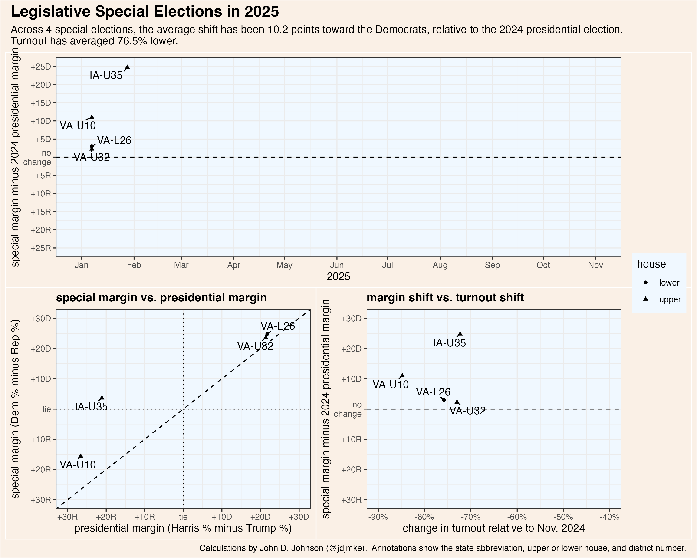

# special-elections-2025

Code and data for analyzing legislative special elections

# method

Ballotpedia tracks [2025 state legislative special elections](https://ballotpedia.org/State_legislative_special_elections,_2025) and [special elections to the 119th Congress](https://ballotpedia.org/Special_elections_to_the_119th_United_States_Congress_(2025-2026)).

I manually enter these elections and their results into `specials.csv`.

The big challenge for this kind of analysis is figuring out what the result of the 2024 presidential election was in each state legislative district. This data is inconsistently available from individual states.

Instead of searching for it, In some cases I take the geojson files from the [national NYT precinct map](https://www.nytimes.com/interactive/2025/us/elections/2024-election-map-precinct-results.html), intersect the center of each precinct with the legislative district boundaries, and aggregate the votes therein. See `precincts-to-districts/aggregate-precincts-to-districts.R` and its output `precincts-to-districts/district-votes-pres2024.csv`.

This method assumes (1) that each 2024 precinct is uniquely contained within a 2025 legislative district boundary and (2) that the NYT data and boundaries are correct.

Finally, `compare-election-outcomes.R` matches the special election result with the presidential election result, saves the file `specials-comparison.csv` and creates the graphic shown above.

The NYT precinct collection is a work-in-progress, so I supplement with data collected in other ways too. Currently, Connecticut's presidential results in legislative districts is built using a Connecticut-specific precinct data file from the CT SoS office.

See `News.md` for updates.